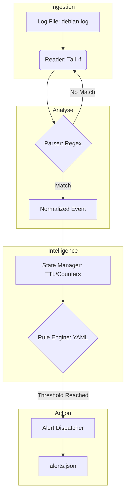

# Architecture Technique - Semaine 2
## Système de Détection "Nyx"

Ce document détaille la conception du moteur de détection implémenté lors de la Semaine 2.

### 1. Flux de Traitement des Événements

Le moteur suit un modèle de pipeline linéaire synchrone :



### 2. Composants et Responsabilités

| Composant | Fichier | Rôle |
| :--- | :--- | :--- |
| **Orchestrateur** | `main.py` | Initialise les composants et gère la boucle infinie de lecture. |
| **Lecteur** | `reader.py` | Lit le fichier log ligne par ligne en temps réel (streaming). |
| **Parseur** | `parser.py` | Transforme les chaînes Syslog en dictionnaires structurés. |
| **Gestionnaire d'État**| `state_manager.py` | Stocke les compteurs d'échecs par IP avec une fenêtre de temps (TTL). |
| **Moteur de Règles** | `rule_engine.py` | Évalue les événements par rapport aux seuils définis en YAML. |
| **Dispatcher** | `alerts.py` | Génère et écrit les alertes au format JSON (MITRE ATT&CK). |

### 3. Modèle de Données Normalisé (JSON-ready)

Chaque log parsé avec succès produira un objet de ce type :
```json
{
    "timestamp": "2026-05-08T14:02:00",
    "source_ip": "10.0.1.50",
    "user": "root",
    "event_type": "ssh_auth_failure",
    "raw_log": "..."
}
```

### 4. Stratégie de Persistance
Le `StateManager` sauvegarde son état interne dans `engine/states.json` périodiquement ou lors de l'arrêt du service pour garantir la continuité de la détection après un redémarrage.
