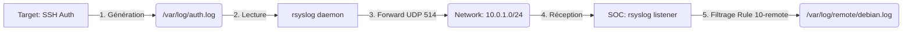

# Deep-Dive 01 : Le Pipeline Syslog (UDP 514)

Ce document détaille techniquement comment les logs de la Target parviennent au SOC.

## 1. Le Standard : RFC 5424 vs RFC 3164
Le protocole Syslog est ancien. La Target (Debian) utilise principalement le format **RFC 3164** (BSD syslog) par défaut avec `rsyslog`.
- **Port standard** : UDP 514.
- **Caractéristique d'UDP** : C'est un protocole "Best Effort" (sans connexion). Si le SOC est éteint, les logs sont perdus.
- **Pourquoi UDP ?** Pour ne pas ralentir la Target. Si le réseau est saturé, la Target continue de travailler sans attendre d'accusé de réception (ACK).

## 2. Le Flux de Données (Data Flow)



## 3. Analyse de la Configuration SOC (`10-remote.conf`)

```bash
$template RemoteLogs,"/var/log/remote/%HOSTNAME%.log"
# LIGNE 1 : Définit un template dynamique. 
# %HOSTNAME% est une propriété extraite du paquet syslog par rsyslog. 
# Si la target s'appelle 'debian', le fichier sera '/var/log/remote/debian.log'.

if $fromhost-ip startswith '10.0.1.' then ?RemoteLogs
# LIGNE 2 : Condition de filtrage.
# On vérifie l'IP source. Si elle appartient au réseau lab (10.0.1.X),
# on applique le template 'RemoteLogs' (le '?' indique l'usage d'un template).

& stop
# LIGNE 3 : Important ! 
# Dit à rsyslog d'arrêter de traiter ce message. 
# Sans cela, le log irait AUSSI dans les fichiers locaux du SOC (/var/log/syslog), 
# ce qui polluerait le serveur.
```

## 4. Point de Vigilance : Les Permissions Système
Pour que ce flux fonctionne, l'utilisateur système `syslog` doit posséder les droits d'écriture sur le dossier.
- **Commande** : `chown -R syslog:adm /var/log/remote/`
- **Pourquoi ?** Par défaut, un dossier créé par `root` n'est pas accessible en écriture par le service `rsyslog` qui tourne avec des privilèges réduits pour des raisons de sécurité.

## 5. Test de compréhension
Peux-tu m'expliquer la différence fondamentale entre l'envoi vers `@10.0.1.10` (actuel) et `@@10.0.1.10` ? (Indice : regarde la section 1 de ce document).
