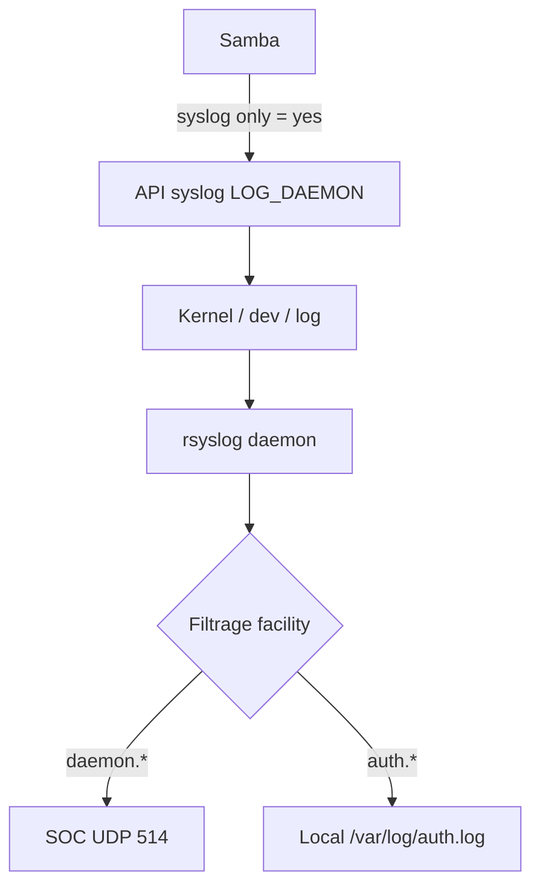

# Deep-Dive 03 : Comprendre les Facilities Syslog et le Pipeline de Logs

Ce document explique comment les messages sont classés et acheminés au sein d'un système Linux vers un SOC distant.

## 1. Le Problème de Samba
Samba était configuré avec `logging = syslog` dans `smb.conf`. Les logs apparaissaient dans `/var/log/syslog` sur la Target, mais n'arrivaient pas sur le SOC malgré la règle `syslog.*` dans `50-forward.conf`.

**Pourquoi ?** Parce que "syslog" en tant que facility ne désigne pas "tous les logs système", mais uniquement les messages internes de rsyslog lui-même.

## 2. Les Facilities Syslog : Le Système d'Aiguillage
Syslog classe chaque message dans une **facility** — une catégorie qui indique quelle partie du système a émis le message. C'est le **processus émetteur** (ex: Samba) qui choisit sa facility quand il appelle l'API syslog du kernel.

| Facility | Contenu | Rôle dans le Lab |
| :--- | :--- | :--- |
| `auth` / `authpriv` | Authentification (SSH, PAM, sudo) | Scénario S1 (Brute-force SSH) |
| `daemon` | Services système génériques (smbd, nginx) | Scénario S2 (Samba) |
| `syslog` | Messages internes de rsyslog lui-même | Diagnostic du pipeline |
| `kern` | Messages du Kernel Linux | Détection réseau bas niveau |

## 3. Le Flux Réel de Samba (smbd)
Quand Samba démarre avec `logging = syslog`, il appelle la fonction C `openlog()` avec la constante `LOG_DAEMON`.

```c
/* Simulation du code source Samba */
openlog("smbd", LOG_PID, LOG_DAEMON);
syslog(LOG_DAEMON | LOG_WARNING, "Authentication failed for user %s", user);
```

**L'analogie du tri postal :**
- Le message de Samba arrive dans l'enveloppe "DAEMON".
- Si ton collecteur ne demande que les enveloppes "SYSLOG", il ne verra jamais les enveloppes "DAEMON".

## 4. La Directive `syslog only = yes`
Sans cette directive dans `smb.conf`, Samba écrit directement dans ses propres fichiers via `fprintf()` (ex: `/var/log/samba/log.smbd`). Rsyslog est alors totalement aveugle car l'API syslog du kernel n'est pas sollicitée.



## 5. Diagnostic Pro : Comment identifier la facility d'un service ?
Si un service ne transmet pas ses logs :
1. **Vérifier la réception locale** : `sudo tail -f /var/log/syslog`. Si le message y est, rsyslog le reçoit.
2. **Identifier la facility** : Dans `/var/log/syslog`, le service est souvent identifié (ex: `smbd`). On sait alors que c'est probablement `daemon`.
3. **Tester la transmission** : Ajouter `daemon.* @10.0.1.10:514` et redémarrer rsyslog.

## 6. Test de compréhension
Pourquoi est-il dangereux de mettre `*.* @10.0.1.10:514` (tout envoyer) sur un serveur de production à fort trafic ?
